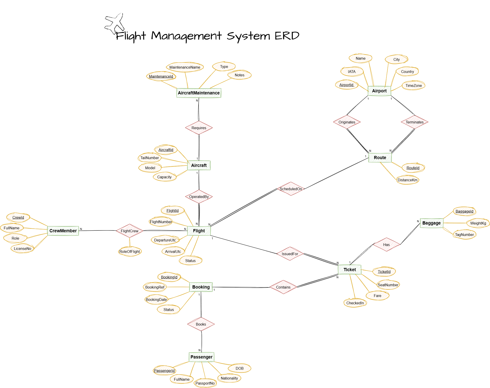

# Flight Management System Summary

## Flight Management System - ERD 

### Entity-Relationship Diagram (ERD) for the Flight Management System, which manages flights, aircraft, crews, bookings, passengers, and airports.

### 1. Airport
**Attributes**  
- `AirportId` (PK)  
- `IATA` (unique)  
- `Name`  
- `City`  
- `Country`  
- `TimeZone`  

**Relationships**  
- Originates **Routes** (1:N)  
- Terminates **Routes** (1:N)  

---

### 2. Aircraft
**Attributes**  
- `AircraftId` (PK)  
- `TailNumber` (unique)  
- `Model`  
- `Capacity`  

**Relationships**  
- Operates **Flights** (1:N)  
- Has **Maintenance Records** (1:N)  

---

### 3. CrewMember
**Attributes**  
- `CrewId` (PK)  
- `FullName`  
- `Role`  
- `LicenseNo`  

**Relationships**  
- Assigned to **Flights** (M:N via `FlightCrew`)  

---

### 4. Route
**Attributes**  
- `RouteId` (PK)  
- `DistanceKm`  

**Relationships**  
- Has **Origin Airport** (N:1)  
- Has **Destination Airport** (N:1)  
- Scheduled as **Flights** (1:N)  

---

### 5. Flight
**Attributes**  
- `FlightId` (PK)  
- `FlightNumber`  
- `DepartureUtc`  
- `ArrivalUtc`  
- `Status`  

**Constraints**  
- Unique (`FlightNumber`, `DepartureUtc.Date`)  

**Relationships**  
- Belongs to **Route** (N:1)  
- Operated by **Aircraft** (N:1)  
- Has **Tickets** (1:N)  
- Staffed by **CrewMembers** (M:N)  

---

### 6. Passenger
**Attributes**  
- `PassengerId` (PK)  
- `FullName`  
- `PassportNo` (unique)  
- `Nationality`  
- `DOB`  

**Relationships**  
- Makes **Bookings** (1:N)  

---

### 7. Booking
**Attributes**  
- `BookingId` (PK)  
- `BookingRef` (unique)  
- `BookingDate`  
- `Status`  

**Relationships**  
- Made by **Passenger** (N:1)  
- Contains **Tickets** (1:N)  

---

### 8. Ticket
**Attributes**  
- `TicketId` (PK)  
- `SeatNumber`  
- `Fare`  
- `CheckedIn`  

**Relationships**  
- Part of **Booking** (N:1)  
- For a **Flight** (N:1)  
- Has **Baggage** (1:N)  

---

### 9. Baggage
**Attributes**  
- `BaggageId` (PK)  
- `WeightKg`  
- `TagNumber`  

**Relationships**  
- Belongs to **Ticket** (N:1)  

---

### 10. AircraftMaintenance
**Attributes**  
- `MaintenanceId` (PK)  
- `MaintenanceDate`  
- `Type`  
- `Notes`  

**Relationships**  
- Performed on **Aircraft** (N:1)  

---

### FlightCrew
**Attributes**  
- `FlightId` (PK/FK)  
- `CrewId` (PK/FK)  
- `RoleOnFlight`  

**Purpose**  
Resolves M:N relationship between **Flight** and **CrewMember**.

# Participation Constraints - Flight Management System

## Total Participation (1..1)
These relationships require **mandatory participation** from the entity on one side:

1. **Flight → Route**  
   - Every Flight must belong to exactly one Route.

2. **Flight → Aircraft**  
   - Every Flight must be operated by exactly one Aircraft.

3. **Ticket → Booking**  
   - Every Ticket must belong to exactly one Booking.

4. **Ticket → Flight**  
   - Every Ticket must be for exactly one Flight.

5. **Booking → Ticket**  
   - Every Booking must contain at least one Ticket.

---

## Partial Participation (0..N)
These relationships allow **optional participation** from the entity on one side:

1. **Airport → Route**  
   - An Airport may have no Routes.

2. **Aircraft → Flight**  
   - An Aircraft may have no Flights assigned.

3. **Flight → FlightCrew**  
   - A Flight may have no Crew assignments.

4. **Passenger → Booking**  
   - A Passenger may have no Bookings.

5. **Ticket → Baggage**  
   - A Ticket may have no Baggage.

---

# Flight Management System – Database Normalization

showing transformations from **First Normal Form (1NF)** to **Second Normal Form (2NF)** and **Third Normal Form (3NF)** using simple example data.

---

## 1. Airport Table

### 1NF – Unnormalized (Repeating groups or combined fields)
| AirportID | IATA  | AirportName         | Location            | TimeZone |
|-----------|-------|---------------------|---------------------|----------|
| 1         | MCT   | Muscat Intl Airport | Muscat, Oman        | +04:00   |
| 2         | DXB   | Dubai Intl Airport  | Dubai, UAE          | +04:00   |

---

### 2NF – Remove partial dependencies (split Location into City and Country)
| AirportID | IATA  | AirportName         | City   | Country | TimeZone |
|-----------|-------|---------------------|--------|---------|----------|
| 1         | MCT   | Muscat Intl Airport | Muscat | Oman    | +04:00   |
| 2         | DXB   | Dubai Intl Airport  | Dubai  | UAE     | +04:00   |

---

### 3NF – Already in 3NF (no transitive dependencies)

---

## 2. Route Table

### 1NF – Combined airports
| RouteID | DistanceKM |
|---------|------------|
| 101     | 415        |
| 102     | 5500       |

---

### 2NF – Separate Origin and Destination Airports
| RouteID | OriginAirportID | DestinationAirportID | DistanceKM |
|---------|-----------------|---------------------|------------|
| 101     | 1               | 2                   | 415        |
| 102     | 2               | 3                   | 5500       |

---

### 3NF – Already in 3NF (no transitive dependencies)

---

## 3. Aircraft Table

### 1NF – Combined model and registration
| AircraftID | TailNumber | Model           | Capacity |
|------------|------------|-----------------|----------|
| A001       | TN001      | Airbus A320     | 180      |
| A002       | TN002      | Boeing 777      | 300      |

---

### 2NF – Already in 2NF (single PK, no partial dependencies)

---

### 3NF – Already in 3NF

---

## 4. Aircraft Maintenance Table

### 1NF
| MaintenanceID | MaintenanceDate | Type        | Notes               | AircraftID |
|---------------|-----------------|-------------|---------------------|------------|
| M001          | 2025-07-01      | Engine Check| Routine engine check| A001       |
| M002          | 2025-07-05      | Tires       | Tire replacement    | A002       |

---

### 2NF – Already in 2NF (single PK)

---

### 3NF – Already in 3NF

---

## 5. Flight Table

### 1NF – Combined Crew list
| FlightID | FlightNumber | RouteID | AircraftID | DepartureUTC       | ArrivalUTC         | Status | CrewIDs        |
|----------|--------------|---------|------------|--------------------|--------------------|--------|----------------|
| F001     | EK101        | 101     | A001       | 2025-08-12 08:00   | 2025-08-12 10:00   | OnTime | C001,C002,C003 |
| F002     | EK102        | 102     | A002       | 2025-08-13 14:00   | 2025-08-13 20:00   | Delayed| C002,C004      |

---

### 2NF – Split crew assignments into FlightCrew junction table

**Flight**

| FlightID | FlightNumber | RouteID | AircraftID | DepartureUTC       | ArrivalUTC         | Status |
|----------|--------------|---------|------------|--------------------|--------------------|--------|
| F001     | EK101        | 101     | A001       | 2025-08-12 08:00   | 2025-08-12 10:00   | OnTime |
| F002     | EK102        | 102     | A002       | 2025-08-13 14:00   | 2025-08-13 20:00   | Delayed|

**FlightCrew**

| FlightID | CrewID | RoleOnFlight |
|----------|--------|--------------|
| F001     | C001   | Pilot        |
| F001     | C002   | Co-Pilot     |
| F001     | C003   | Cabin Crew   |
| F002     | C002   | Pilot        |
| F002     | C004   | Cabin Crew   |

---

### 3NF – Already in 3NF

---

## 6. CrewMember Table

### 1NF
| CrewID | FullName      | Role       | LicenseNo    |
|--------|---------------|------------|--------------|
| C001   | John Smith    | Pilot      | LIC123       |
| C002   | Alice Johnson | Co-Pilot   | LIC234       |
| C003   | Bob Williams  | Cabin Crew | LIC345       |
| C004   | Karen Brown   | Cabin Crew | LIC456       |

---

### 2NF & 3NF – Already normalized

---

## 7. Passenger Table

### 1NF – Combined Nationality and DOB fields
| PassengerID | FullName       | PassportNo | Nationality,DOB       |
|-------------|----------------|------------|----------------------|
| P001        | Ahmed Ali      | P123456    | Oman, 1990-05-14     |
| P002        | Fatima Al Balushi | P234567 | Oman, 1995-11-22     |

---

### 2NF – Separate Nationality and DOB fields
| PassengerID | FullName         | PassportNo | Nationality | DOB        |
|-------------|------------------|------------|-------------|------------|
| P001        | Ahmed Ali        | P123456    | Oman        | 1990-05-14 |
| P002        | Fatima Al Balushi| P234567    | Oman        | 1995-11-22 |

---

### 3NF – Already in 3NF

---

## 8. Booking Table

### 1NF – Multiple tickets stored in one row
| BookingID | BookingRef | BookingDate | Status | PassengerID | Tickets                 |
|-----------|------------|-------------|--------|-------------|-------------------------|
| B001      | REF123     | 2025-07-10  | Confirmed | P001      | T001, T002              |
| B002      | REF124     | 2025-07-12  | Cancelled | P002      | T003                    |

---

### 2NF – Split tickets into Ticket table

**Booking**

| BookingID | BookingRef | BookingDate | Status    | PassengerID |
|-----------|------------|-------------|-----------|-------------|
| B001      | REF123     | 2025-07-10  | Confirmed | P001        |
| B002      | REF124     | 2025-07-12  | Cancelled | P002        |

**Ticket**

| TicketID | BookingID | FlightID | SeatNumber | Fare | CheckedIn |
|----------|-----------|----------|------------|------|-----------|
| T001     | B001      | F001     | 12A        | 120  | Yes       |
| T002     | B001      | F001     | 12B        | 120  | No        |
| T003     | B002      | F002     | 14A        | 150  | No        |

---

### 3NF – Already in 3NF

---

## 9. Baggage Table

### 1NF – Combined baggage weight and tag
| BaggageID | WeightKg, TagNumber | FlightID |
|-----------|---------------------|----------|
| BAG001    | 20, BG123           | F001     |
| BAG002    | 18, BG124           | F002     |

---

### 2NF – Separate weight and tag number
| BaggageID | WeightKg | TagNumber | FlightID |
|-----------|----------|-----------|----------|
| BAG001    | 20       | BG123     | F001     |
| BAG002    | 18       | BG124     | F002     |

---

### 3NF – Already in 3NF

---
